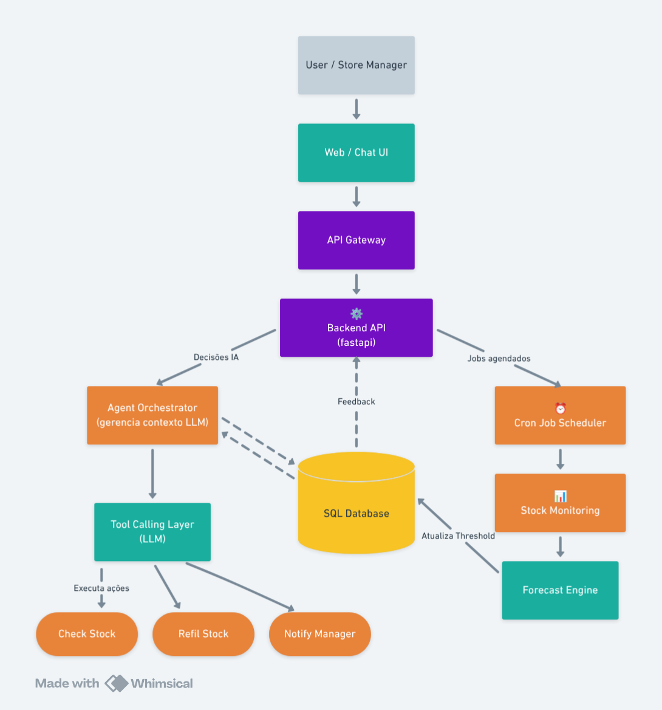

# Stock Management Assistant

## Overview

A proposta é desenvolver uma POC (Prova de Conceito) que demonstre a capacidade de projetar uma arquitetura com IA Agêntica e Multi-tenancy em um ambiente SaaS.

A solução seria um **Assitente de Gestão de Estoque Inteligente**. O Assistente deve permitir que o usuário consulte o estoque da loja de forma conversativa e também, disparar ações de reabastecimento quando o estoque estiver abaixo do mínimo.

## Como executar

uvicorn app.main:app --reload

Por ser POC, o schema do banco é inicializado automaticamente no startup da aplicação via SQLAlchemy. Em um ambiente produtivo, essa responsabilidade seria delegada a um mecanismo de migrations.

## Escopo e Limitações

Esta POC foca em demonstrar arquitetura, orquestração e multi-tenancy, não cobrindo aspectos como observabilidade, segurança avançada e escalabilidade em larga escala. Também não aplicaremos todos os pontos relacionados à complexidade do modelo de IA, pois focaremos na arquitetura.

## Decisões de Design

O assistente precisa funcionar em dois fluxos:
- Usuário pode solicitar ao agente informações sobre o estoque, e assim sendo o agente coletará informações recentes para responder o usuário (fluxo conversacional)
- O agente precisa saber quando os estoques estão baixos e tomar uma ação a partir disso (fluxo proativo)

Neste último ponto iremos precisar destrinchar de duas formas, isso baseado em algumas considerações: 
- o estoque terá um limite mínimo que não necessariamente é fixo.
- o limite pode variar de acordo com o tenant, com o tipo de produto, com a localização do estoque específico, dentre outras variáveis
- poderíamos programar uma interface em que o usuário define os limites do estoque dele, entretanto estaríamos desperdiçando a oportunidade de usar a IA e os dados coletados a nosso favor. Não faz sentido ter algo tão manual quando podemos otimizar e deixar com que o usuário final não se preocupe com certos indicadores.

Portanto, seria interessante utilizar ferramentas de inteligência artificial ou machine learning para saber qual sería esse limite mínimo, esse threshold. Teremos alguns elementos no nosso sistema que podem ajudar nesse controle:

1 - O limite será um dado persistido no banco de dados. 
2 - O limite será preferencialmente mudado pelo próprio sistema de forma inteligente, com a ajuda de predições.
3 - Será utilizada uma ferramenta de previsão de séries temporaris (ex: Prophet, statsmodels...), para atualizar os limites mínimos de forma dinâmica.

A razão de escolher uma ferramenta que não uma LLM para fazer essa predição é que seria muito custoso utilizar a LLM a cada vez que um evento fosse disparado devido a uma alteração no estoque, portanto a ferramenta de previsão de séries "protege" o agente de ser chamada toda vez, o objetivo é que o agente só seja requisitado nesse caso quando os estoques estiverem baixos, para tomada de decisão.

**Resumo:**
    Agente -> Tomada de decisão
    Previsão de séries temporais -> Cálculos relacionados ao negócio

**Fluxo conversativo (on-demand)**

O **fluxo conversativo** será usado para consulta de informações a respeito do estoque. A ideia é que os gerentes da loja tenham uma interface, um chatbot, para consultar informações de seus estoques de forma mais simples e intuitiva possível. Ao fazer uma pergunta ao chatbot, o agente poderá consultar informações obtidas a partir de uma camada de recuperação de dados (RAG) composta por informações persistidas ou coletadas sob demanda. Se a informação dos estoques daquele tenant forem antigas, o agente fará uma consulta ativa ao banco para recolher os novos dados.

Resumindo o fluxo:

- Usuário consulta informações a respeito do estoque.

- Agente verifica se já tem essas informações.

- Se agente não tem essas informações, irá buscar em uma fonte externa - no caso o banco de dados.

- Agente gera a resposta ao usuário

**Fluxo proativo (batch / schedule)**

Antes de entrar nos detalhes do fluxo proativo, precisamos entender o contexto da aplicação. Se considerarmos um sistema de larga escala, com milhares de tenants e necessidade de atualizações em tempo real, faz sentido utilizarmos uma arquitetura orientada a eventos para lidar com o caso, e vamos destrinchar um pouco essa projeção de um SaaS rodando em produção no mercado, com vários clientes, mais ao final deste documento. Por enquanto, por se tratar de uma POC, trabalhar com event-driven architecture poderia ser utilizar algo grande demais para uma proposta simples, portanto, a POC poderá utilizar cron jobs para processos mais simples, conforme será explicado.

O **fluxo proativo** será utilizado para reabastecimento dos estoques. A ideia é um sistema integrado com um agente, esse sistema, na POC, tera um cron job configurado para consultar a base de dados e verificar a quantidade de produtos em estoque. Ao recuperar essa informação, caso os estoques estejam abaixo do limite definido, ele irá consultar o agente, passando a situação atual e também as ferramentas (funções) da api que podem ser utilizadas de acordo com cada decisão da LLM, em um processo de tool calling. A api recebe a resposta com a definição de qual função deve ser executada e como será executada.
Por outro lado, é importante definir como esse limite, esse threshold, será computado. Como explicado no capítulo (O problema), utilizaremos uma ferramenta de previsão de séries temporais para definir esse threshold, por tenant, por estoque, por produto etc.. dependendo das regras de negócio que serão aplicadas. Para isso, utilizaremos este mesmo Cron Job - que roda em um intervalo de minutos ou horas - para alimentar a ferramenta que fará a previsão das séries temporais com os dados atuais do banco. Essa ferramenta calcula valores mais assertivos de limite mínimo de estoque baseado em dados e estatísticas. Se o valor que consta no estoque já for abaixo do valor mínimo, imediatamente esse serviço vai se comunicar com o agente de IA que irá decidir o que fazer.

Resumindo o fluxo:

- Cron job roda a cada intervalo determinado de minutos. 

- Consulta banco de dados relacional (por tenant).

- Calcula um valor que faça sentido para o limite mínimo de acordo com projeções.

- Identifica produtos abaixo do mínimo, caso haja.

- Monta um contexto resumido.

- Chama o agente (LLM).

- Agente decide:
    reabastecer
    ignorar
    sugerir algo

- Por fim, a API executa a ação indicada pelo agente.

É importante que o intervalo não seja curto demais de modo a não sobrecarregar os componentes do sistema. Considerando que, caso a POC futuramente se torne um SaaS em ambiente produtivo, terão diversos agentes acessando simultaneamente o banco de dados para recolher essas informações. Um intervalo curto demais poderia sobrecarregar o banco, assim gerando gargalos ou exigindo uma quantidade excessiva de instâncias a serem escaladas.
Outro fator é o custo da LLM. LLMs trial tem um limite de uso e as pagas podem acabar cobrando um valor alto caso haja uma quantidade excessiva de requisições em um curto período. 

Uma opção viável na lógica da aplicação seria utilizar uma arquitetura orientada a eventos. Na arquitetura orientada a eventos, os componentes se comunicam de forma mais desacoplada, através de tópicos e filas onde mensagens são "postadas" e aguardam até serem consumidas por algum outro componente. Essa abordagem é interessante e faz bastante sentido se pensarmos em um SaaS em produção, onde é importante escalar quando necessario e persistir mensagens ainda que algum componente falhe. A questão é que em uma POC talvez uma api com um Cron Job mais simples já fosse suficiente, considerando que a POC tem fins demonstrativos, e não de ser consumida em larga escala. Um sistema mais event-driven, talvez com Change Data Capture, onde haja um stream de eventos que seja processada por workers, pode ser uma boa abordagem futuramente, quando o SaaS já estiver no mercado e sendo amplamente utilizado.

## Arquitetura

### Requisitos Funcionais

 - O usuário deverá consultar o estoque da loja a partir de uma interface, como se fosse um chatbot.
 - O sistema deve automaticamente disparar ações de reabastecimento quando o estoque estiver abaixo do mínimo.
 - O usuário pode definir qual é o estoque mínimo.
 - O Agente pode agir de forma proativa como também receber inputs do usuário.
 - O sistema será multi-tenant. Cada gerente de loja será um tenant.
 - Os tenants terão acesso ao mesmo banco de dados, havendo uma separação lógica das informações por tenant.
 - Os tenants terão acesso à interface pelo mesmo domínio (endereço). A interface saberá quem é o tenant através da autenticação e contexto.

### Requisitos Não-Funcionais

 - Isolamento de dados entre tenants.
 - Baixo acoplamento entre agentes e regras de negócio.
 - Custos controlados de uso de LLM.

 ### System Design

 

**Usuário / Gerente de Loja:**
Acessa o sistema via interface web ou chat para visualizar estoques, receber alertas e tomar decisões sobre reabastecimento.

**Interface Web / Chat:**
Interface amigável que permite interação com o sistema através de chat conversacional ou dashboard visual.

**API Gateway:**
Ponto de entrada único que gerencia autenticação, rate limiting e roteamento de requisições.

**Backend API (FastAPI):**
API principal desenvolvida em FastAPI que orquestra todas as operações do sistema, desde autenticação até processamento de regras de negócio.

**Agent Orchestrator:**
Responsável por coordenar a comunicação com a LLM e gerenciar o contexto das conversas e decisões.

**Tool Calling Layer (LLM):**
Camada que integra com Claude/GPT usando tool calling para que a IA decida autonomamente quais ações tomar quando o estoque está baixo.

**Tool: Check Stock:**
Ferramenta que verifica o status atual do estoque em tempo real e retorna informações detalhadas.

**Tool: Refill Stock:**
Ferramenta que automaticamente cria ordem de compra com fornecedores quando necessário reabastecer.

**Tool: Notify Manager:**
Ferramenta que envia notificações (email, SMS, push) para o gerente quando requer atenção humana.

**Cron Job Scheduler:**
Executa tarefas agendadas periodicamente, como recálculo de thresholds dinâmicos e verificação de estoques.

**Stock Monitoring Service:**
Serviço que monitora continuamente os níveis de estoque e compara com os thresholds dinâmicos calculados.

**Forecast Engine:**
Motor de previsão que usa modelos estatísticos (Prophet, ARIMA) para calcular thresholds dinâmicos baseados em sazonalidade e tendências.

**Banco de Dados Relacional:**
Armazena dados de produtos, estoques, histórico de vendas, thresholds dinâmicos e informações dos tenants.